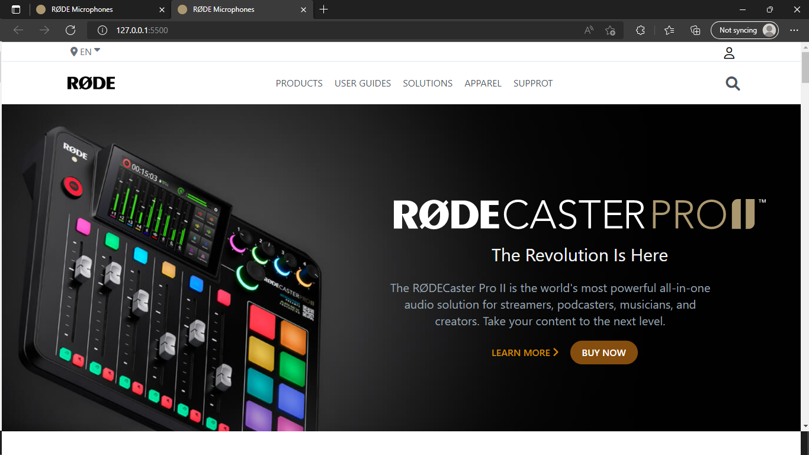

Rode Clone

Time Required : (8Hrs)

Tech Stack : Tailwind css

In Rode Clone Project I learned how to learn through documentation and how to use it in real word projects how it's easy to make website responsive using tailwind css

[Deployed Link](https://rode-ui-clone-website.netlify.app/)

